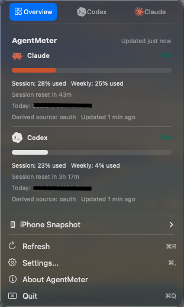
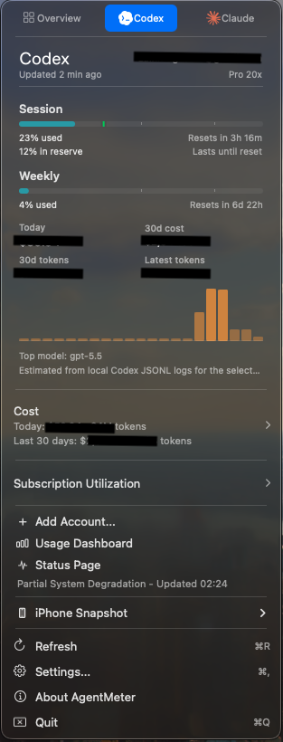
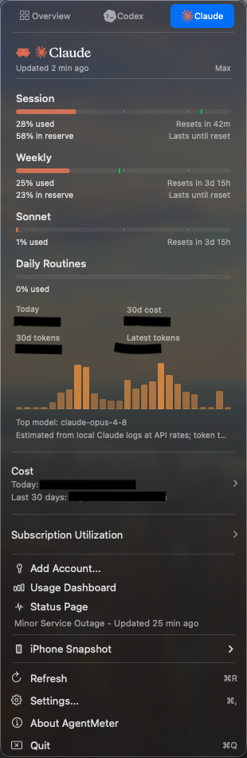
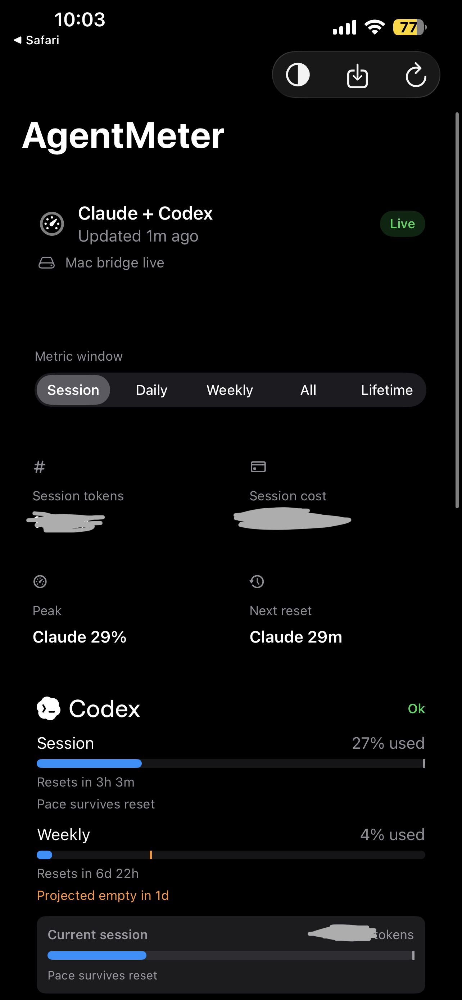
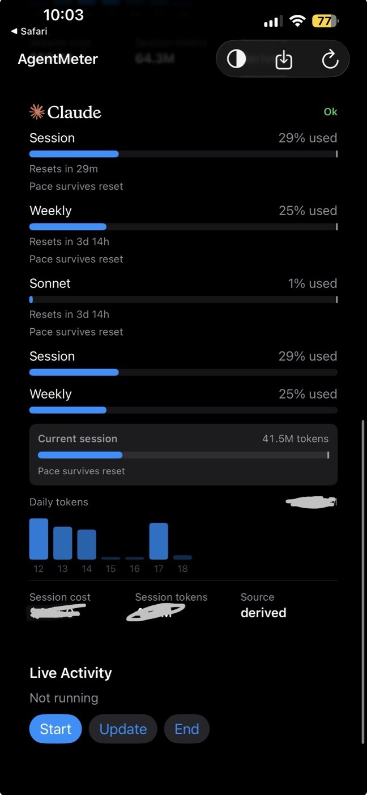

<div align="center">
  

  # AgentMeter

  **AI usage limits, reset windows, and spend without leaving your menu bar.**

  [](LICENSE)
  
  
  

  <sub>AgentMeter runs locally on your Mac and syncs to your iPhone over your LAN.</sub>
</div>

## What it is

AgentMeter is a macOS menu-bar app with an iPhone companion, widget, and Live Activity for tracking AI coding-assistant usage. It keeps the numbers that matter in view: session caps, weekly/monthly windows, reset countdowns, token usage, and estimated spend.

It is Claude- and Codex-first, with broader provider coverage inherited from [CodexBar](https://github.com/steipete/CodexBar).

## What AgentMeter adds

AgentMeter is a fork of [CodexBar](https://github.com/steipete/CodexBar) by Peter Steinberger. CodexBar provides the Mac provider engine, menu-bar foundation, broad provider adapters, and much of the packaging base. AgentMeter keeps that foundation and adds:

- iPhone app, home-screen widget, and Live Activity for Claude/Codex windows.
- Local Mac-to-iPhone sync over Bonjour, with no cloud service.
- HMAC-SHA256 request signing with nonce/timestamp replay protection.
- Sanitized phone snapshots that reject secret-shaped data before serving.
- Keychain-backed pairing and provider credential storage.
- AgentMeter identity, icon, docs, app packaging, and source-release cleanup.
- Claude/Codex-first defaults with source-confidence labels for brittle provider data.

## Screenshots

<table>
  <tr>
    <td align="center"></td>
    <td align="center"></td>
    <td align="center"></td>
  </tr>
  <tr>
    <td align="center"><sub>Menu overview</sub></td>
    <td align="center"><sub>Codex limits</sub></td>
    <td align="center"><sub>Claude limits</sub></td>
  </tr>
</table>

<p align="center">
  
  
</p>

These screenshots show the real app with sensitive values redacted.

## Quick start

Requirements:

- macOS 14 or newer.
- Xcode command line tools: `xcode-select --install`.
- Xcode if you want to build the iPhone app to a device.

After cloning:

```bash
cd AgentMeter

swift build
swift run AgentMeter
```

AgentMeter has no Dock icon. Click the robot in the menu bar to open the dashboard.

For a local packaged app:

```bash
make start-release
```

That builds the release binary, packages `AgentMeter.app`, verifies it, and installs it to `/Applications`.

## Pair the iPhone app

1. Open `AgentMeteriOS/AgentMeteriOS.xcodeproj` in Xcode.
2. Set your own signing team and bundle identifiers.
3. Build the `AgentMeteriOS` scheme to your iPhone.
4. On the Mac, open AgentMeter and choose the iPhone snapshot/pairing action.
5. Open the pairing link or QR on the phone.

The phone stores a per-device token in the iOS Keychain and discovers the Mac over Bonjour. macOS may ask for Local Network access on first use.

## Privacy model

- No telemetry.
- No hosted backend.
- Provider credentials stay on the Mac and belong in Keychain.
- The iPhone receives a usage-only snapshot, not provider cookies, access tokens, or raw cache files.
- The local bridge uses an OS-assigned port and advertises `_agentmeter._tcp` over Bonjour.
- Authenticated bridge requests are signed and replay-protected.

Provider data quality varies. Official APIs are preferred, local CLI/cache sources are second best, and unofficial/private endpoints are labeled as brittle rather than presented as perfect truth.

## Providers

Claude and Codex are the primary supported path. AgentMeter also inherits CodexBar's wider provider matrix, including Cursor, Gemini, Copilot, OpenRouter, OpenAI API, and others. Enable only the providers you actually use.

## Common commands

```bash
swift build
swift test
./Scripts/lint.sh lint

swift build -c release --product AgentMeter
./Scripts/agentmeter_package_local_app.sh
./Scripts/agentmeter_verify_local_app.sh .agentmeter-artifacts/AgentMeter-*.app
```

Important packaging detail: the package script wraps the existing release binary. If Swift code changed, run `swift build -c release --product AgentMeter` before packaging.

## Forking and rebranding

AgentMeter pins its macOS menu-bar identity on purpose. Do not casually change the bundle id, status-item autosave name, or Background Task Management identity in an existing install.

For a clean fork, follow [docs/FORKING.md](docs/FORKING.md). It covers the Swift identity prefix, macOS bundle id, iOS bundle ids, App Groups, icons, and release configuration.

## Credits

AgentMeter is built on [CodexBar](https://github.com/steipete/CodexBar), Copyright (c) 2026 Peter Steinberger, MIT licensed.

AgentMeter changes are Copyright (c) 2026 Zain Mughal and are also MIT licensed. See [LICENSE](LICENSE).
